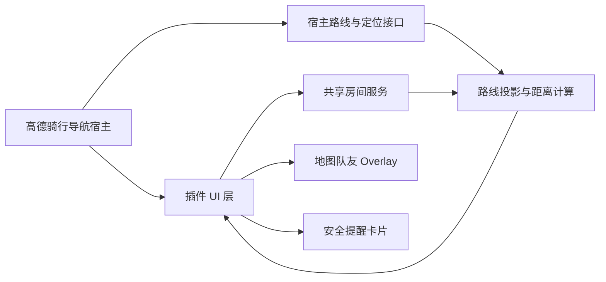

# 高德地图插件化接入方案

## 结论

当前公开资料没有显示高德地图 App 存在面向第三方开发者自由发布的插件市场。因此，本项目不能像浏览器扩展一样“直接安装进高德地图 App”。更现实的路径是：

- 作为高德官方合作插件提案提交评审
- 作为高德地图 App 内骑行导航功能的产品需求方案
- 在获得官方宿主能力前，先用独立 PWA 跑通真实用户验证

## 插件目标

在高德骑行导航 A 点到 B 点过程中，让多个同行骑友共享实时位置，并在同一骑行地图上显示：

- 每位伙伴在当前骑行路线上的位置
- 与我的沿路线距离，而不是直线距离
- 前方 / 后方关系
- 智能领骑、跟骑、收队角色
- 掉队风险与建议汇合点
- 微信分享加入房间

## 高德宿主需要开放的能力

若要成为高德地图 App 内插件，需要高德宿主提供以下接口或 UI 插槽：

1. 当前骑行路线 polyline
2. 当前用户 GPS、速度、定位精度
3. 导航地图 overlay 绘制能力
4. 骑行导航页内侧栏 / 浮层 / 底部卡片 UI 插槽
5. 打开分享面板或微信分享能力
6. 高德账号体系或临时房间身份能力
7. 插件生命周期：进入导航、暂停导航、结束导航、退出共享
8. 权限弹窗：明确告知位置共享范围与结束方式

## 当前原型已实现的能力

- 房间创建、加入、邀请
- 服务端实时同步
- GPS 坐标同步
- 经纬度投影到路线
- 按路线里程差计算队友距离
- 智能领骑 / 跟骑 / 收队
- 掉队风险提醒
- 微信友好的分享文案
- PWA 安装与公网部署准备

## 插件化架构建议

## MVP 合作范围

第一阶段建议只做导航中轻量共享：

- 领骑创建共享房间
- 微信分享给骑友
- 骑友打开高德后加入同一路线
- 地图显示队友头像点位
- 顶部或底部显示最近伙伴、掉队风险
- 结束导航时自动结束共享

## 隐私与安全要求

- 必须显式开启共享
- 必须显示正在共享状态
- 必须一键退出共享
- 不默认保存历史轨迹
- 房间链接需要过期机制
- 队友位置只在同一房间内可见
- 骑行过程中减少遮挡，避免复杂操作

## 当前可交付物

- `.amap/plugin-proposal.json`：插件提案元数据
- `server.js`：房间与实时同步服务
- `app.js`：路线投影、距离计算、智能角色、前端交互
- `render.yaml` / `Dockerfile`：公网部署配置
- `release/cycling-buddy-live-sync.zip`：可演示包

## 下一步

1. 用 PWA 公网版本招募 3-5 组骑友测试
2. 收集真实骑行时的安全提醒和界面遮挡反馈
3. 准备产品 PRD、插件能力清单、隐私说明
4. 联系高德开放平台或商务合作渠道
5. 若高德提供宿主接口，再把当前 PWA 前端改造成宿主插件 UI
